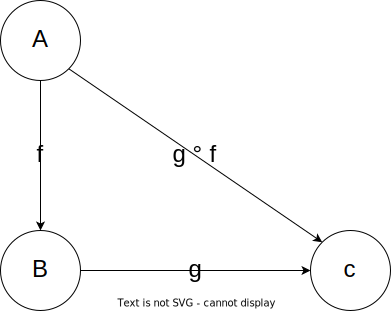
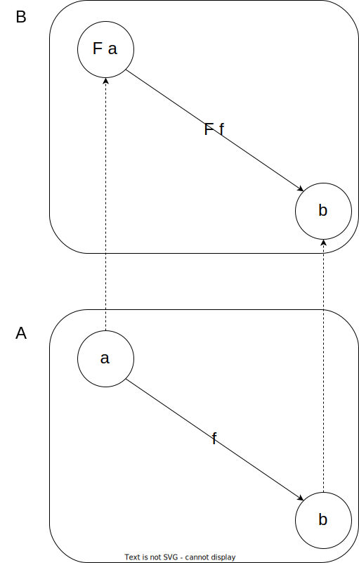

# Category Theory

This is branch of mathematics, with the goal of studying the relationships between objects and morphisms. It's a very powerful tool that can be used to model many different things and help us to reason about them.

When we talk about categories, we talk about the set of objects and the relationships between them, called morphisms. The objects can be anything, like sets, types, or even other categories. The morphisms can be functions that map from one object to another, for example, in the category of sets (Set) one object can be all the natural numbers and the morphism can be the function that maps from the natural numbers to the even numbers.

Also, somethings interesting is that we can visualize this transformations as arrows between objects. 



And more interesting yet, we can compose these arrows!

But, how can we generalize more theses concepts? We can create arrows between categories, this is called a functor, a mapping between categories.



In Haskell, the mapping between categories is called `Functor`, and it's a typeclass that has a method called `fmap` that maps from one category to another.

```haskell
class Functor f where
  fmap :: (a -> b) -> f a -> f b
```

> Typeclasses are a way to generalize the types, building types of types.

### Maybe

We can implement a new Functor called `Maybe` this takes a type and can be `Just` or `Nothing`.

```haskell
data Maybe a = Just a | Nothing
```

> The `a` is a type variable, and it's a type that we don't know yet.

And we can implement the `Functor` instance for `Maybe`.

```haskell
instance Functor Maybe where
  fmap f (Just a) = Just (f a)
  fmap f Nothing = Nothing
```

> The `f` is a function that maps from one type to another.

This is a very simple example and we can use this to create better code, for example:

```haskell
head :: [a] -> a
head [] = error "Empty list"
head (x:xs) = Just x
```

This function takes the first element of a list, but if the list is empty, it raises an error. This can complicate our code, so we can use the `Maybe` type to handle this case.

```haskell
safeHead :: [a] -> Maybe a
safeHead [] = Nothing
safeHead (x:xs) = Just x
```

Now, if we want work with the result of this function, we can use the `fmap` function.

```haskell
main :: IO ()
main = do
  let list = [1, 2, 3]
  let maybeHead = safeHead list
  let maybeHeadPlusOne = fmap (+1) maybeHead
  print maybeHeadPlusOne -- Just 2k
```

> Really cool, right? It's a very simple example, but we can use to create more complex things.

### List

The list also is a Functor, and we can implement the `Functor` instance for it.

```haskell
data List a = Nil | Cons a (List a)
```

And the `Functor` instance for `List`.

```haskell
instance Functor List where
  fmap f Nil = Nil
  fmap f (Cons a list) = Cons (f a) (fmap f list)
```

> The type `List` is a recursive type, and it's a list of `a`'s. The `Nil` is the empty list, and the `Cons` is the constructor that takes an `a` and a `List a` and returns a `List a`.

Now, we can use the `fmap` function to map over the list.

```haskell
main :: IO ()
main = do
  let list = Cons 1 (Cons 2 (Cons 3 Nil))
  let listPlusOne = fmap (+1) list
  print listPlusOne -- Cons 2 (Cons 3 (Cons 4 Nil))
```

> This is the same to `map`fuction, because the `map` is a especial case of `fmap` for lists.

This a way to implement the type `List`, but in Haskell we have the syntax sugar for lists `[a]`, where `[]` is the empty list.

## IO

In JavaScript, we have the Promise type, that is a way to handle asynchronous code. In Haskell, we have something similar, the `IO` type and this can work like a box that contains a value, but we don't know what is inside, however, we can use this value and transform it.

```haskell
main :: IO ()
main = do
  number <- fmap read getLine
  print number
```

> The `do` notation is a way to write imperative code in Haskell, and the `<-` is a way to get the value inside the `IO` type.

The `getLine` function is a way to get the input from the user, and the `read` function is a way to convert a string to a number. We used the `fmap` function to open the box, modify the content and put it back in the box.


What's so special about this? The operation of reading the input, displaying a message, and write in a file, are all side effects, and they can be dangerous, because they can change the state of the program. But, in Haskell, we can use the `IO` type to handle this side effects, and we can use the `fmap` function to transform the value inside the box.

## Monads

The Monads are a version generalization of the Functor, and they are a way to compose functions that return a value inside a box. The `Maybe` and `List` types are examples of Monads, and we can implement the `Monad` typeclass for them.

```haskell
class Functor m => Monad m where
  return :: a -> m a
  (>>=) :: m a -> (a -> m b) -> m b
```

